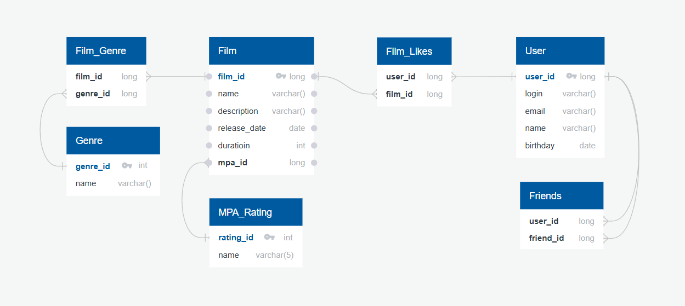

# Java-Filmorate
Template repository for Filmorate project.

## Описание проекта

Filmorate - это приложение, которое позволяет пользователям делиться мнениями о фильмах, добавлять друг друга в друзья и
получать персонализированные рекомендации фильмов на основе лайков.

## Основной функционал

### Схема базы данных




## API Endpoints

### Пользователи
- `POST /users` - создание пользователя
- `PUT /users` - обновление пользователя
- `GET /users` - получение всех пользователей
- `GET /users/{id}` - получение пользователя по ID
- `PUT /users/{id}/friends/{friendId}` - добавление в друзья
- `DELETE /users/{id}/friends/{friendId}` - удаление из друзей
- `GET /users/{id}/friends` - список друзей пользователя
- `GET /users/{id}/friends/common/{otherId}` - список общих друзей

### Фильмы
- `POST /films` - создание фильма
- `PUT /films` - обновление фильма
- `GET /films` - получение всех фильмов
- `GET /films/{id}` - получение фильма по ID
- `PUT /films/{id}/like/{userId}` - поставить лайк фильму
- `DELETE /films/{id}/like/{userId}` - удалить лайк у фильма
- `GET /films/popular?count={count}` - топ фильмов по количеству лайков

## Примеры SQL-запросов для основных операций

### Получение всех фильмов
```sql 
SELECT f.id, f.name, f.description, f.release_date, f.duration, f.mpa_id, m.name AS mpa
FROM films f
LEFT JOIN mpa_ratings m ON f.mpa_id = m.mpa_id"
```  

### Получение всех пользователей
```sql
SELECT *
FROM users;
```

### Получение списка общих друзей
```sql
SELECT u.* 
FROM users u 
WHERE u.id IN (
        SELECT f1.friend_id 
        FROM friends f1 
        WHERE f1.user_id = ?) 
    AND u.id IN (
        SELECT f2.friend_id 
        FROM friends f2 
        WHERE f2.user_id = ?);
```
